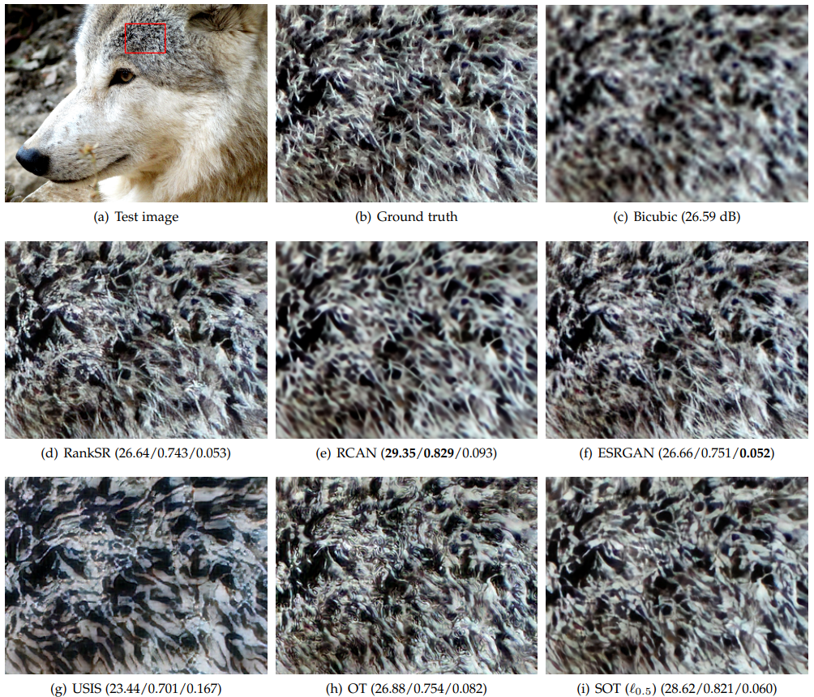
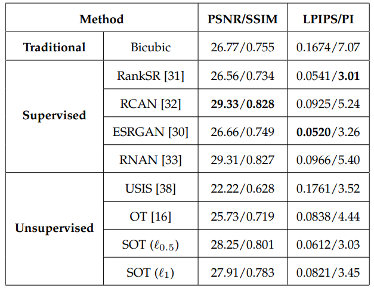
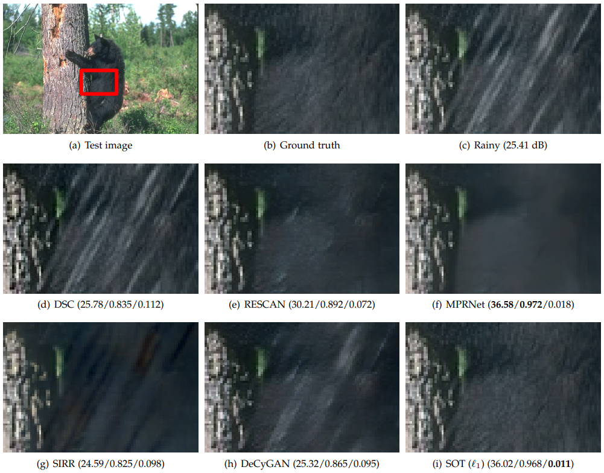
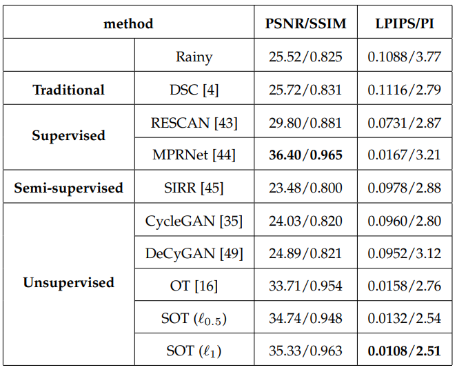
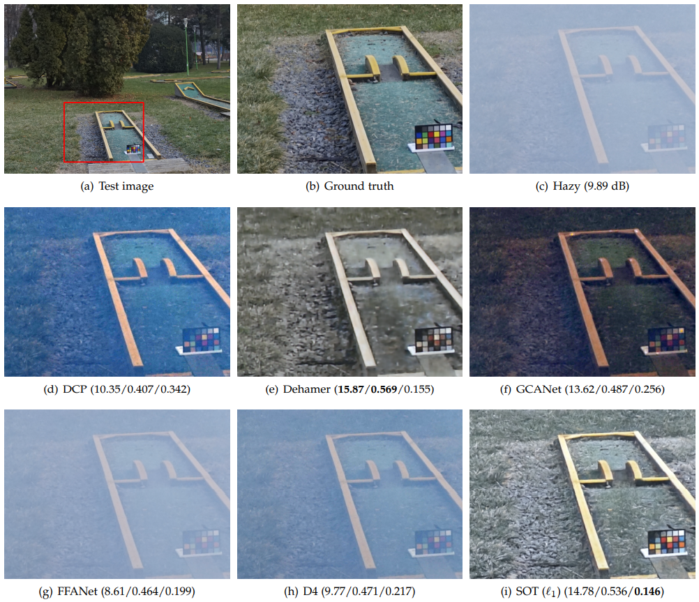
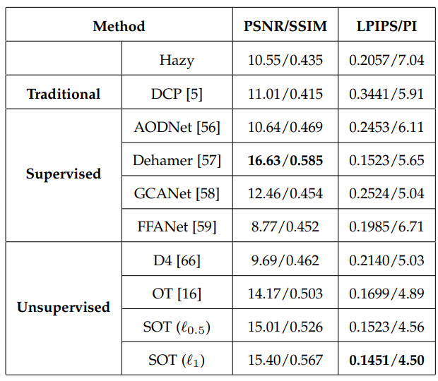

# SOT
# Sparsity-Aware Optimal Transport for Unsupervised Restoration Learning
**Fei Wen**, **Wei Wang**, **Wenxian Yu**

**Abstract**:
_Recent studies show that, without any prior model, the unsupervised restoration learning problem can be optimally formulated as an optimal transport (OT) problem, which has shown promising performance on denoising tasks to approach the performance of supervised methods. However, it still significantly lags behind state-of-the-art supervised methods on complex restoration tasks such as super-resolution, deraining, and dehazing. In this paper, we exploit the sparsity of degradation in the OT
framework to significantly boost its performance on these tasks. First, we disclose an observation that the degradation in these tasks is quite sparse in frequency domain, and then propose a sparsity-aware optimal transport (SOT) criterion for unsupervised restoration learning. Further, we provide an analytic example to illustrate that exploiting the sparsity helps to reduce the ambiguity in finding an inverse map for restoration. Experiments on real-world super-resolution, deraining, and dehazing demonstrate that SOT can improve the PSNR of OT by about 2.6 dB, 2.7 dB and 1.3 dB, respectively, while achieving the best perception scores among the compared supervised and unsupervised methods. Particularly, on the three tasks, SOT significantly outperforms existing unsupervised methods and approaches the performance of state-of-the-art supervised methods._

The trained models are provided [here](https://drive.google.com/drive/folders/1ZUF_9URf4Tht2xsB_E7CCCNREPxq_9cd?usp=share_link). The proposed formulation is implemented in an adversarial training framework using [WGAN-gp](https://proceedings.neurips.cc/paper/2017/hash/892c3b1c6dccd52936e27cbd0ff683d6-Abstract.html). The generator is modified from part of [MPRNet](https://github.com/swz30/MPRNet) and the discriminator is modified from that of [SRGAN](https://github.com/tensorlayer/srgan). We use them here only for academic use purpose.

## Datasets

In this section, we will introduce the datasets we use for each experiment. 

### Image Super-Resolution

Training and testing code can be found in folder `./sr`

#### Synthetic Image Super-Resolution

We use a high quality image dataset [DIV2K](https://data.vision.ee.ethz.ch/cvl/DIV2K/) for training and testing. .

#### Real-Word Image Super-Resolution

We use a real super-resolution dataset [RealVSR](https://github.com/IanYeung/RealVSR) for training and testing. 

### Image Super-Resolution

Training and testing code can be found in folder `./deraining`

#### Synthetic Image Deraining

We use a synthetic image dataset [Rain1800](https://drive.google.com/file/d/1_pP8fR-gpHUB0q1kpvZxKALvjLZ-JVM8/view) for training and dataset [Rain100L](http://www.cs.yorku.ca/~kamel/sidd/) for testing.

#### Real-world Image Deraining

We use a real image dataset [SPA](https://github.com/stevewongv/SPANet) for training and testing.

### Image Dehazing

Training and testing code can be found in folder `./dehazing`

#### Synthetic Image Dehazing

We use a synthetic dehazing dataset [OTS](https://sites.google.com/view/reside-dehaze-datasets) for training and testing. 

#### Real-World Image Dehazing

We use a real  dehazing dataset [Dense-haze](https://data.vision.ee.ethz.ch/cvl/ntire19//dense-haze/) for training and testing. 

All these datasets are only used for academic purpose.

## Getting started

### Python requirements

This code requires:

- Python 3.6
- torch 1.8.0
- h5py, opencv-python, numpy

### Preparing training dataset

We use the hdf5 files to store training data, you can use the code `generate_train_compress.m` in the folder `/gdata` to generate your own dataset from image folders. And the code `readH5.py` is used to merge two hdf5 files into one, which is useful in some experiments.

### Training networks

Take the synthetic image super-resolution as an example, to train the proposed method:

```
cd sr_synthetic
python train.py --nEpochs=200 --gpus="0" --trainset="./data/" --sigma=[100,50,30,10]

```

### Validation using a trained network

Take the synthetic image super-resolution as an example, to run a validation dataset through a trained network:

```
cd sr_synthetic
python test.py --model="./checkpoint/model_pre_super4_200_50.pth" --dataset="./DIV2K" --save="./results" --gpu="0"
```

## Some results

### (1) Results on synthetic image super-resolution:

**Visual comparison on 4x synthetic image super-resolution. The PSNR/SSIM/LPIPS results are provided in the brackets. The images are enlarged for clarity.**



**Quantitative comparison on 4x super-resolution of synthetic images (using the DIV2K dataset)**



### (2) Results on synthetic image deraining:

**Visual comparison on synthetic image deraining. The PSNR/SSIM/LPIPS results are provided in the brackets. The images are enlarged for clarity.**



**Quantitative comparison of the deraining methods on synthetic data(the Rain1800 and Rain100L datasets are used for training and testing, respectively).:**



### (3) Results on real-world image dehazing:

**Visual comparison on a challenging real-word image dehazing task with severe haze. The PSNR/SSIM/LPIPS results are provided in the brackets. The images are enlarged for clarity**



**Quantitative comparison of the compared methods on real-world data (using the Dense-haze dataset).:**


